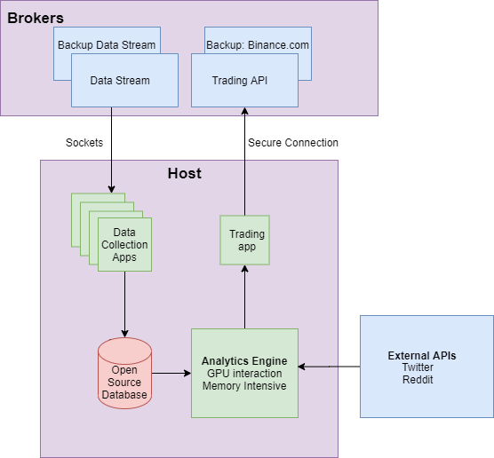

# Analyze financial data with Streamlit

Dependencies: Postgres, Slack, Binance API, Technical Analysis library ++

### Deploy locally (windows)

python -m venv v20\app

.\v20\app\Scripts\activate

pip install -r requirements.txt

python .\v20\historic_app.py

### Architecture

